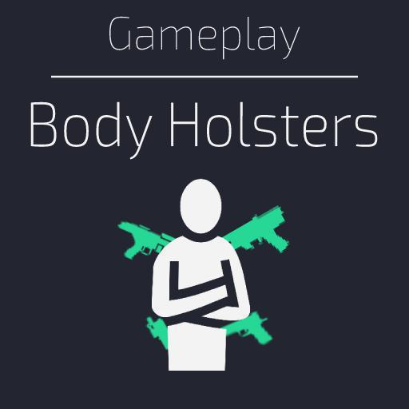
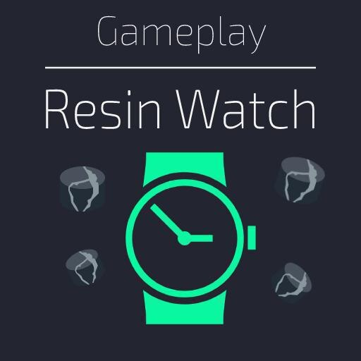
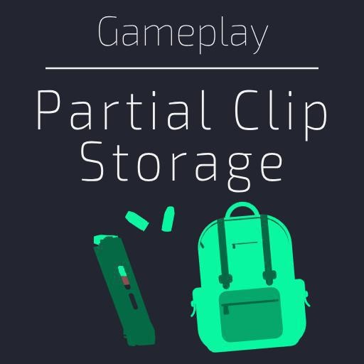
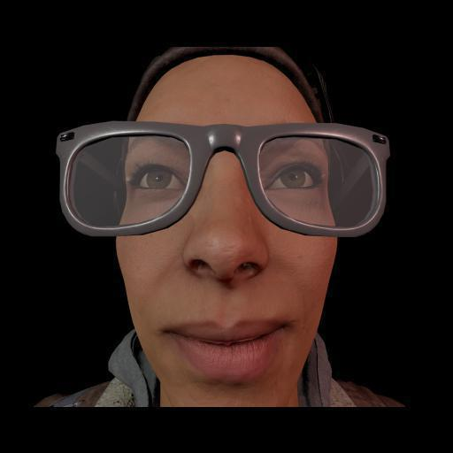
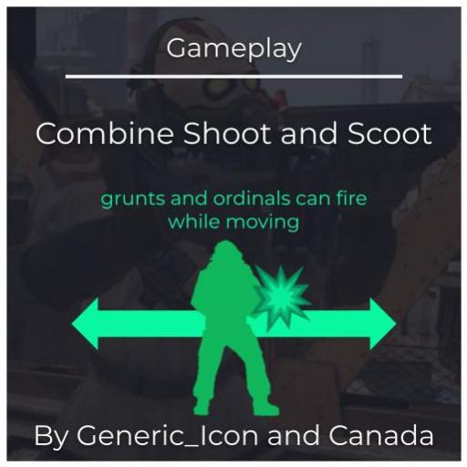
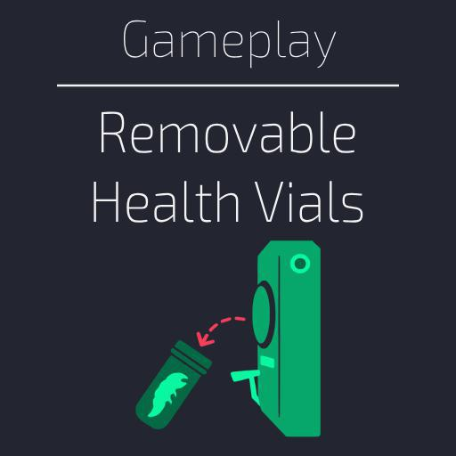

<picture>
    
</picture>

> [!TIP]
> **New:** I've launched a dedicated [Documentation Website](https://frostsource.github.io/alyxlib/) and a standalone [Installer App](https://frostsource.github.io/AlyxLibInstaller/) to make setup easier!

 

 

---

AlyxLib provides a set of useful Lua libraries for scripting with **Half-Life: Alyx**, making your development process smoother and more efficient.

Your addon is linked to AlyxLib via symbolic links, ensuring that every addon uses the same source and gets updated automatically whenever AlyxLib is updated. Plus, since your workshop item uses AlyxLib as a requirement, it will also receive any fixes without you having to reupload.

## 📚 Library overview

* Full VScript code completion using [Lua Language Server](https://luals.github.io/).
* Save/Load most data types easily to any entity.
* Custom class implementation for entities, including inheritance and automatic variable saving.
* Player interaction simplification and tracking of items.
* Send data to and from Panorama ←→ Lua.
* Easy controller input tracking with function callbacks.
* Lots of useful debugging functions and console commands.
* A fully customizable in-game debug menu.

See the [Documentation Website](https://frostsource.github.io/alyxlib/) for component breakdowns, function references, and code examples.

## 🚀 Quick setup guide

> [!NOTE]
> For in-depth or manual setup, see the [Getting Started Guide](https://frostsource.github.io/alyxlib/getting_started/app_installation.html).

1. **[Download AlyxLib Installer](https://frostsource.github.io/AlyxLibInstaller/)** and run the app.

2. Follow the setup instructions within the app to download AlyxLib.

3. Open your addon from the file menu and select the AlyxLib modules you wish to use.

4. **Before uploading:** Click the `Remove For Upload` button in the app.

5. Upload your addon to the workshop and set [AlyxLib](https://steamcommunity.com/sharedfiles/filedetails/?id=3329679071) as a required item.

6. Rename the `0000000000.lua` file in `scripts/vscripts/mods/init/` to match the workshop ID of your new workshop item [(this is the same process outlined in Scalable Init Support)](https://github.com/PeterSHollander/scalable_init_support?tab=readme-ov-file#for-workshop-release)

7. Click `Install` in the app to restore the AlyxLib files in your addon.

## ❓ Need help?

If you run into issues, feel free to [create an issue](https://github.com/FrostSource/alyxlib/issues).

You can also join us on  [Discord](https://discord.gg/42SC3Wyjv4) for faster responses.

## 🌟 Projects using AlyxLib

