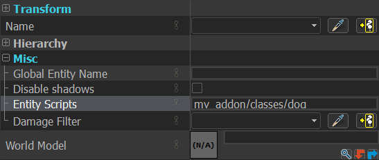
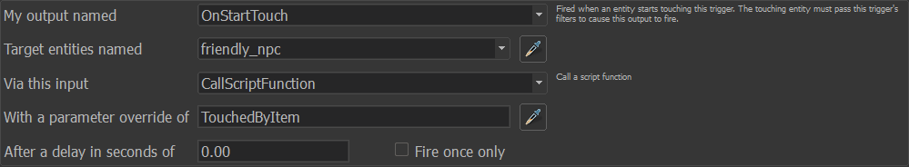

# Entity Classes

Entity classes are a core component of AlyxLib, which simplifies the process of creating and managing entities with shared behavior. Entity classes allow you to define a set of properties and functions that can be shared across multiple entities, making it easier to create complex behaviors and interactions between entities.

Overview of features:

- Automatic state saving
- Multiple inheritance
- 

## Basic Declaration

An entity class is declared using the `entity()` function.

```lua
local base = entity("MyClass")
```

If `entity()` is called in a script attached to an entity, the entity will automatically inherit the class and any subsequent entities using the script will inherit the already created class without recreating it each time.

To manually inherit a class at any point you can use the `inherit()` function.

```lua
-- Force the entity running this script to inherit MyClass.
inherit("MyClass")

-- Or specify an entity to inherit MyClass.
inherit("MyClass", entity)
```

!!! note
    Currently there is no built-in way to manually inherit a class and preserve the inheritance between game loads.  
    The recommended approach is to attach the script directly to the entity.  
    Persistent inheritance support is planned for a future update.

### Basic Template

```lua
if thisEntity then
    -- Inherit this script if it's directly attached to an entity
    -- Will also load the script at the same time if needed
    inherit(GetScriptFile())
    return
end

---@class ClassName : EntityClass
local base = entity("ClassName")

---Called automatically on spawn.
---@param spawnkeys CScriptKeyValues
function base:OnSpawn(spawnkeys)
end

---Called automatically after OnActivate, when EasyConvars and Player have initialized.
---@param readyType OnReadyType
function base:OnReady(readyType)
end

---Main entity think function. Think state is saved between loads.
function base:Think()
    return 0
end

---The script returns the class table so it can be inherited directly.
return base
```

!!! example ""
    For a full list of built-in EntityClass methods see the [class reference](../reference/class.md#methods)

You can attach your class script to an entity like normal using `Misc -> Entity Scripts: my_addon/classes/dog`



Class scripts can technically be anywhere in the vscripts folder, but to avoid naming conflicts and to keep things clean it's recommended to place them all in a `classes` subfolder of your addon script folder.

!!! note ""
    :material-folder-open: `scripts`  
    &emsp;:material-folder-open: `vscripts`  
    &emsp;&emsp;:material-folder-open: `my_addon`  
    &emsp;&emsp;&emsp;:material-folder-open: `classes`  
    &emsp;&emsp;&emsp;&emsp;:material-language-lua: `animal.lua`  
    &emsp;&emsp;&emsp;&emsp;:material-language-lua: `cat.lua`  
    &emsp;&emsp;&emsp;&emsp;:material-language-lua: `dog.lua`  

## Methods

Methods are simply functions that belong to the class.

```lua
function base:AddHealth(n)
    self:SetHealth(self:GetHealth() + n) -- (1)!
end

function base:MultiplyHealth(n)
    self:SetHealth(self:GetHealth() * n)
end
```

1. Remember to use `self` in the method to reference the entity rather than the class.

Methods can be called via Hammer I/O simply using the `CallScriptFunction` input. The activator and caller will be passed into the first parameter as a table.

```lua
---@param params IOParams
function base:TouchedByItem(params)
    if IsValidEntity(params.activator) then -- (1)!
        if params.activator:GetName() == "multi_healer" then
            self:MultiplyHealth(2)
        else
            self:AddHealth(20)
        end
    end
end
```

1. There are some rare cases where `activator` or `caller` might not be a valid entity, so it's good practice to check first.



## Properties

Properties are class values which are automatically saved and inherited.

!!! note
    Properties are only saved when the value is directly changed. If the property stores a table and a key is changed, the table will not automatically save because the reference is unchanged. You can use [`self:Save()`](../reference/class.md#save) to force a full or specific save.

Properties should be declared in the class definition.

```lua
---@class Animal : EntityClass
local base = entity("Animal")

---Declare a class property.
base.legs = 4
```

When getting/setting the property value, `self` should be used to make sure the instance value is accessed instead of the initial base class.

```lua
function base:SetLegs(num)
    assert(num >= 0, "Animals can't have negative legs")

    self.legs = num
end
```

Properties with a double underscore prefix '`__`' will not automatically save. This is useful for large table/data values that don't need persistence but still need to be part of the class. This also keeps the entity's context cleaner, as tables especially take up a lot of room.

```lua
---This value is not saved.
---@type EntityHandle[]
base.__allNearbyEntities = {}
```

## Inheritance

Inheritance is a key concept in object-oriented programming. It allows you to create classes which "inherit" the behavior of a parent class. This is useful for creating a hierarchy of related classes which share common methods and properties.

=== ":paw_prints: Animal"

    ```lua
    ---@class Animal : EntityClass (1)
    local base = entity("Animal")

    function base:Speak()
        print("Animal noise")
    end
    ```

    1. Lua Language Server needs to be told we are inheriting `EntityClass` even though it is inherited automatically in the `entity` function.

=== ":dog: Dog"

    ```lua
    ---@class Dog : Animal (1)
    local base = entity("Dog", "Animal") -- (2)!

    ---Override the base method with new functionality.
    function base:Speak()
        print("Woof!")
    end
    ```

    1. Animal already inherits `EntityClass`, so by inheriting `Animal` we also inherit `EntityClass` and get correct code completion.
    2. The inheritance parameter can be the string name, a direct class table reference, or the path to the class script as long as it returns the class table reference.

=== ":cat: Cat"

    ```lua
    ---@class Cat : Animal
    local base = entity("Cat", "Animal")

    function base:Speak()
        print("meow")
    end
    ```

Entity classes in AlyxLib support "multiple inheritance" making it easier to create a flexible class hierarchy and to share code between classes.

Multiple inheritance lets you create entities that combine behaviors from different sources. For instance, a `Dog` might provide basic animal behavior, while a `CombatReady` class adds attack logic. By inheriting from both, we can define an `AttackDog` that barks *and* bites.

=== ":crossed_swords: CombatReady"

    ```lua
    ---@class CombatReady : EntityClass
    local base = entity("CombatReady")
    CombatReady = base -- (1)!

    base.damage = 10

    ---@param enemy EntityHandle
    function base:Attack(enemy)
        local dmg = CreateDamageInfo(self, self,
            self:GetForwardVector() * self.damage,
            self:GetAttachmentNameOrigin("mouth"),
            self.damage,
            DMG_SLASH
        )

        enemy:TakeDamage(dmg)

        DestroyDamageInfo(dmg)
    end
    ```

    1. Storing the class table in a global variable allows us to easily access it in other scripts.

=== ":wolf: AttackDog"

    ```lua
    ---@class AttackDog : Dog, CombatReady
    local base = entity("AttackDog", "Dog", "CombatReady")

    ---Override method to speak while calling base attack method
    function base:Attack(enemy)
        CombatReady.Attack(self, enemy) -- (1)!
        self:Speak()
    end
    ```

    1. There is no built in "super" functionality yet, but it's on the way.

!!! tip
    When a class inherits from multiple parents, members are resolved in the order they’re listed.  
    If both `Dog` and `CombatReady` define the same method or property, the version from `Dog` will be used because it appears first in the inheritance list.

Because entity classes restructure an entity’s metatable, you can override built-in methods without affecting other entities.  
This makes it possible to customize native behavior in a class-specific way, without requiring other code to be aware of your class’s internal structure.

```lua
---Notify console when this entity is moved.
---@param origin Vector
function base:SetOrigin(origin)
    CBaseEntity.SetOrigin(self, origin) -- (1)!
    print("Setting origin for " .. Debug.EntStr(self))
end
```

1. When calling a method from a base entity, use dot notation (`.`) instead of colon notation (`:`) so you can explicitly pass the instance as the first argument.

## Thinking

Starting and maintaining a think function is abstracted into a single `Think` that you can define in your class, with easy functions to pause and resume. The current state of the think is also saved between game loads so you don't have to worry about restarting it.

```lua
---@class ThinkExample : EntityClass
local base = entity("ThinkExample")

base.lastPrintedSecond = -1
base.elapsedTime = 0

---Start thinking only on first spawn
---@param spawnkeys CScriptKeyValues
function base:OnSpawn(spawnkeys)
    print("Save and load within 20 seconds to see think state persistence")
    self:ResumeThink()
end

function base:Think()
    self.elapsedTime = self.elapsedTime + FrameTime()
    local seconds = math.floor(self.elapsedTime)

    if seconds % 2 == 0 and seconds ~= self.lastPrintedSecond then
        print("Server time is even: " .. seconds)
        self.lastPrintedSecond = seconds
    end

    if seconds > 20 then
        print("Stopping Think after 20 seconds")
        return self:PauseThink() -- (1)!
    end

    return 0 -- (2)!
end
```

1. `PauseThink()` returns `nil`, and your `Think` function **must also return** `nil` to stop further processing.
2. Returning `0` from the `Think` function schedules it to run again immediately with no delay.

## Events

Game/Player events and entity outputs can be defined in a class using the built-in entity class methods.

=== "Game Event"

    ```lua
    ---Update this ResinDisplay whenever a player puts resin in their backpack.
    ---@param params GameEventPlayerDropResinInBackpack
    base:GameEvent("player_drop_resin_in_backpack", function(self, params) -- (1)!
        ---@cast self ResinDisplay (2)
        self:UpdateDisplay(Player:GetResin())
    end)
    ```

    1. `self` must be declared explicitly because this is an anonymous function, not a method defined with colon (`:`) syntax.
    2. Unfortunately due to Lua Language Server limitations, we must explicitly cast `self` to the correct type within the function.

=== "Player Event"

    ```lua
    ---@param params PlayerEventItemPickup
    base:PlayerEvent("item_pickup", function(self, params)
        ---@cast self SpecialDevice
        if params.item == self then
            self:ResumeThink()
        end
    end)

    ---@param params PlayerEventItemReleased
    base:PlayerEvent("item_released", function(self, params)
        ---@cast self SpecialDevice
        if params.item == self then
            self:PauseThink()
        end
    end)
    ```

=== "Output"

    ```lua
    ---Activate this item_healthcharger trap when the player starts healing.
    ---@param params IOParams
    base:Output("OnHealingPlayerStart", function(self, params)
        ---@cast self HealthChargerTrap
        self:StartCountdownAndExplode()
    end)
    ```

!!! tip
    In some cases it might be more performant to register one game event in a global script instead of for each entity, especially if you have many entities using the class.
    
    ```lua
    ---Update all ResinDisplays whenever a player puts resin in their backpack.
    ---@param params GameEventPlayerDropResinInBackpack
    ListenToGameEvent("player_drop_resin_in_backpack", function(params)
        local resin = Player:GetResin()
        for _, display in ipairs(GetAllDisplays()) do -- (1)!
            display:UpdateDisplay(resin)
        end
    end, nil)
    ```

    1. `GetAllDisplays()` would be a global function returning all existing `ResinDisplay` entities.

## Hooks

Entity classes support all standard entity hooks, plus an extra `OnReady` hook to run code when AlyxLib systems are ready.

```lua
---"Activate" hook.
---@param activateType ActivationType
function base:OnActivate(activateType)
end

---"OnBreak" hook.
---@param inflictor EntityHandle
function base:OnBreak(inflictor)
end

---"OnTakeDamage" hook.
---@param damageTable OnTakeDamageTable
function base:OnTakeDamage(damageTable)
end

---"Precache" hook.
---@param context CScriptPrecacheContext
function base:Precache(context)
end

---"Spawn" hook.
---@param spawnkeys CScriptKeyValues
function base:OnSpawn(spawnkeys)
end

---"UpdateOnRemove" hook.
function base:UpdateOnRemove()
end

---Fired by the "Activate" hook after time has passed for AlyxLib systems to set up.
---@param readyType OnReadyType
function base:OnReady(readyType)
end
```

## Real Examples

This is a list of links to entity classes being used in released addons.

- Resin Watch (Item Tracker) https://github.com/FrostSource/resin_watch/blob/main/scripts/vscripts/resin_watch/classes/watch.lua
- Removable Health Vials https://github.com/FrostSource/removable_health_vials/blob/main/scripts/vscripts/removable_health_vials/health_station.lua
- Alyx Wears Glasses https://github.com/FrostSource/alyx_optometry/blob/main/scripts/vscripts/alyx_optometry/classes/glasses.lua
- PortalsInHLA https://github.com/FrostSource/PortalsInHLA/tree/overhaul/scripts/vscripts/portal/classes