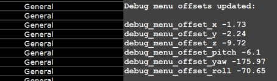

The **AlyxLib Debug Menu** is a customizable panorama panel that provides quick access to developer-defined console commands and other actions for AlyxLib and its addons.

## Using The menu

!!! info ""
    **In its current release, the debug menu requires adding `-dev` to the *Half-Life: Alyx* launch parameters in Steam.**

After loading into a map with AlyxLib enabled:

- Press the **menu button** on your controller **three times in a row** to open the menu.
- The menu appears attached to your **primary hand** by default.

### Interacting with the menu

- **Physically press** buttons with your finger, or
- **Aim at buttons** from a distance and use the **menu activate button** (usually the shooting trigger).

### Navigating the menu

- Options are grouped into **category tabs**; select a tab to see its related options.
- To scroll **from a distance**, hover your finger over the **top  or bottom scroll zones**.
- To close the menu, press the **"Close Menu"** button at the top.

!!! note
    There is limited interactivity from a distance due to Valve induced limitations. You can press buttons and change slider values but you **cannot drag** or **scroll using the sidebar** remotely.

### Repositioning the menu

!!! tip ""
    If you have changed debug menu settings, make sure [debug_menu_lock](../console/debug_menu.md#debug_menu_lock) is set to **0** before trying to reposition the menu.

When the menu is open, press the title bar at the top and keep the controller button held down to start the dragging mode.  
While dragging the menu, you can also move your other hand to find the best position for the menu.

When you are happy with the position of the menu, release the controller button to stop dragging and the menu will attach back to the hand. This position will remain until the map ends.

**If you want to save the position of the menu permanently**, open the console after dragging the menu to the desired position and locate the latest section with the title **"Debug menu offsets updated:"**.

Copy the 6 `debug_menu_offset*` lines and paste them into your `debug_menu.cfg` file (see [Customizing the menu as a player](#customizing-the-menu-as-a-player)).

??? example "Console Example"
    

!!! note
    A [floating menu](../console/debug_menu.md#debug_menu_floating) can be dragged around but will not print offset values. A floating menu always opens in front of the player.

## Customizing the menu as a player

Navigate to the `cfg` folder of your Half-Life Alyx install directory, e.g. `Steam\steamapps\common\Half-Life Alyx\game\hlvr\cfg`.

Create file called `debug_menu.cfg` and open it in a text editor.

Add any of the following settings to the file.

### Basic settings

```c
// The hand to attach the debug menu to, 0 = Secondary, 1 = Primary
debug_menu_hand 1

// The height of the debug menu, in range [7,30]
debug_menu_height 14

// Set to 1 to make the debug menu float in the world
// instead of attached to a hand
debug_menu_floating 0

// Set to 1 to lock the debug menu so it cannot be dragged around
debug_menu_lock 0

// Set to 1 to enable the extras tab by default
debug_menu_extras 0

// The below offset values can be found in the console after dragging
// the menu to the desired position in-game

// The relative offset position of the menu attached to a hand
debug_menu_offset_x 4
debug_menu_offset_y -9
debug_menu_offset_z 0
// The relative offset angles of the menu attached to a hand
debug_menu_offset_pitch 0
debug_menu_offset_yaw 180
debug_menu_offset_roll 0
```

### Adding options

You can add your own menu options to execute console commands without ever having to open the console.

```c
/// A category is a tab of the debug menu that contains options
/// A category must always be defined before adding options to it
/// Syntax: debug_menu_add_category <name>
debug_menu_add_category "My Custom Category"

/// A separator is a line in the menu with optional text
/// Syntax: debug_menu_add_separator [text]
debug_menu_add_separator "Buttons"

/// A button fires the same command every time
/// Syntax: debug_menu_add_button <text> <command>

// Simple button that fires a command
debug_menu_add_button "Spawn Zombie" "npc_create npc_zombie"

// Multiple commands can be fired using a semicolon between each command
debug_menu_add_button "Gear Up" "impulse 101; impulse 102"

debug_menu_add_separator "Toggles"

/// A toggle is a button that turns on and off
/// Syntax: debug_menu_add_toggle <text> <command> [on/off]
/// Syntax: debug_menu_add_toggle <text> <command_off> <command_off> [on/off]

// Simple toggle that turns `sv_infinite_ammo` on and off
debug_menu_add_toggle "Infinite Ammo" sv_infinite_ammo

// You can force a toggle to start on regardless of convar
// by writing "on" or "1" at the end of the line
// This doesn't affect the convar
debug_menu_add_toggle "Toggle godmode" god on

// You can use custom values for the on/off states
debug_menu_add_toggle "Toggle Slowmo" "host_timescale 1" "host_timescale 0.5"

// Custom toggle on/off values start starts on
debug_menu_add_toggle "Game Sounds" "volume 0" "volume 1" on

debug_menu_add_separator "Sliders"

/// A label is for informational text
/// Syntax: debug_menu_add_label <text>
debug_menu_add_label "Remember Infinite Ammo Above"

/// A slider lets you choose a number value from a range
/// Syntax: debug_menu_add_slider <text> <convar> <min> <max> [options]
/// Options:
///       % - Value is shown as a percentage
///      .N - Truncate to N decimal places
///      +N - Snap increment to N
///      @N - Default value

debug_menu_add_slider "Rapidfire ROF" vr_rapidfire_rof 0.01 10

debug_menu_add_slider "Rapidfire Spread" vr_rapidfire_bullet_spread_max 0 80 % +1

debug_menu_add_slider "Hand Scale" "vr_hand_scale" 0.5 2 .1 +0.1

debug_menu_add_separator "Cycles"

/// Cycles let you choose from a predefined set of items
/// Syntax: debug_menu_add_cycle <text> <"name:command"> ... [default]

// Each item has a name and a command, separated by a colon, i.e. "Name:Command"
debug_menu_add_cycle "Gravity" "Space:sv_gravity 0" "Xen:sv_gravity 125" "Earth:sv_gravity 386" "Crushed:sv_gravity 1000"

// Cycles using many commands can be simplified by defining them beforehand
debug_menu_add_cycle_cmd "vr_hand_pose_debug"
debug_menu_add_cycle_cmd "vr_hand_pull_acceleration_debug"
debug_menu_add_cycle_cmd "ai_path_draw_active"
// Then using debug_menu_add_cycle_map with space separated values for each command in the order they were defined
debug_menu_add_cycle_map "Debug" "None:0 0 0" "Hand:1 0 0" "Glove:0 1 0" "Path:0 0 1"

// An example of the above Gravity cycle using debug_menu_add_cycle_cmd
debug_menu_add_cycle_cmd "sv_gravity"
// The number at the end of the line is the default. In this case the third item is Earth
debug_menu_add_cycle_map "Gravity" "Space:0" "Xen:125" "Earth:386" "Crushed:1000" 3
```

!!! tip
    You can add as many categories as you want to keep things organized!
    Just use `debug_menu_add_category` again and keep adding options.

!!! tip
    These commands can be used in-game to test their functionality before saving them to the CFG.

## Scripting the menu as a developer

Adding your own controls to the menu using code for testing or addon settings is incredibly easy and allows for much more thoughtful logic than the console commands.

Start by creating a script to contain your menu logic, e.g. `scripts/vscripts/my_addon/debug_menu.lua`

Make sure to load it in your init script (or wherever you load scripts)

```lua
require "my_addon.debug_menu"
```

Now add a category tab to the menu using `DebugMenu:AddCategory`. The first parameter is the unique ID for the category; it should not be **"alyxlib"** or any common name that's likely to clash with another category. The second parameter is the display text.

```lua
DebugMenu:AddCategory("my_addon", "My Addon")
```

!!! tip
    Assign your category ID to a variable so if it needs changing later you only need to change it in one place:

    ```lua
    local categoryId = "my_addon"

    DebugMenu:AddCategory(categoryId, "My Addon")
    ```

### Buttons

Buttons simply execute a command or function when pressed.

```lua
DebugMenu:AddButton(categoryId, buttonId, text, command)
```

```lua
DebugMenu:AddButton("my_addon", "spawn_zombie_id", "Spawn Zombie", "npc_create npc_zombie")
```

Function callbacks allow for much more control. In the case of the above button, we can spawn the zombie closer and customize it.

```lua
DebugMenu:AddButton("my_addon", "spawn_zombie", "Spawn Zombie", function(button)
    local spawnPos = Player:GetOrigin() + Player:GetWorldForward() * 64

    SpawnEntityFromTableSynchronous("npc_zombie", {
        origin = spawnPos,

    	bloater_position = RandomInt(-1, 5),
        -- 30% chance of armored
	    armored_headcrab = RandomChance(0.3),
        -- 50% chance of releasing headcrab on death
        spawnflags = RandomChance(50, 516, 131588)
    })
end)
```

### Toggles

Toggles are on/off switches that toggle the value of a convar and/or execute a function.

```lua
DebugMenu:AddToggle(categoryId, toggleId, text, convar, callback, startsOn)
```

```lua
-- Direct console command
DebugMenu:AddToggle("my_addon", "infinite_ammo", "Infinite Ammo", "sv_infinite_ammo")

-- Function callback
DebugMenu:AddToggle("my_addon", "infinite_ammo", "Infinite Ammo", "sv_infinite_ammo", function(on, toggle)
    -- A callback means we must handle the convar ourselves
    -- the convar is used to determine the toggle state when the menu opens
    Convars:SetBool("sv_infinite_ammo", on)

    -- or using the toggle instance convar (assuming it was set)
    Convars:SetBool(toggle.convar, on)
end)

-- The convar can be voided if state is entirely handled by you
DebugMenu:AddToggle("my_addon", "infinite_ammo", "Infinite Ammo", nil, function(on, toggle)
    CustomAmmoHandler(on)
end, GetIsInfiniteAmmo()) --(1)!
```

1. You can optionally give a default starting state to help with manual state management.

### Sliders

Sliders allow you to choose a number value from a range.

```lua
DebugMenu:AddSlider(categoryId, sliderId, text, convar, callback, min, max, isPercentage, truncate, increment, defaultValue)
```

```lua
-- Simple slider with min/max values, and no callback (nil)
DebugMenu:AddSlider("my_addon", "rapidfire_rof", "Rapidfire ROF", "vr_rapidfire_rof", nil, 0.01, 10)

-- Display as percentage, default truncating, snap to increments of 1
DebugMenu:AddSlider("my_addon", "rapidfire_spread", "Rapidfire Spread", "vr_rapidfire_bullet_spread_max", nil, 0, 80, true, nil, 1)

-- Truncate to 1 decimal place, snap to increments of 0.1
DebugMenu:AddSlider("my_addon", "handscale", "Hand Scale", "vr_hand_scale", nil, 0.5, 2, false, 1, 0.1)

-- Function callback with no convar attached
DebugMenu:AddSlider("my_addon", "my_slider", "My Slider", nil, function(value, slider)
    if value == 0 then
        CustomDisableFunction()
    else
        CustomHandlingFunction(value)
    end
end, 0.5, 3, true, 1, 0.1)
```

### Cyclers

Cyclers allow you to choose a named value from a list of options by cycling through them.

```lua
DebugMenu:AddCycle(categoryId, cycleId, title, convar, callback, values, defaultValue)
```

The values are specified as an array of tables with the `text` and `value` fields.

The `text` is what is shown in the menu, and the `value` is what is set in the convar.

```lua
-- Typical cycle with a convar and pre-defined values
DebugMenu:AddCycle("my_addon", "gravity", "Gravity", "sv_gravity", {
    { text = "Space", value = 0 },
    { text = "Xen", value = 125 },
    { text = "Earth", value = 386 },
    { text = "Crushed", value = 1000 },
})

-- If your convar uses ordered integers starting from 0 you can omit the values
DebugMenu:AddCycle("my_addon", "movetype", "Movement", "hlvr_movetype_default", {
    "Blink", "Shift", "Continuous", "Continuous Hand"
})

-- Of course you can always omit the convar completely and just use a callback
DebugMenu:AddCycle("my_addon", "my_cycle", "My Cycle", nil, {
    { text = "Option 1", value = 1 },
    { text = "Option 2", value = 2 },
    { text = "Option 3", value = 3 },
}
function(index, item, cycle)
    -- Here `item` is a table with the `text` and `value` fields
    if item.value > 1 then
        DoSomething(item.value)
    else
        DoSomethingElse(item.value)
    end
end)
```

### Labels

A label is for informational text. It appears centered horizontally.

```lua
DebugMenu:AddLabel(categoryId, labelId, text)
```

```lua
DebugMenu:AddLabel("my_addon", "my_label", "My Label")
```

### Separators

A separator is a line in the menu with optional text.

```lua
DebugMenu:AddSeparator(categoryId, separatorId, text)
```

Use separators to group options together.

```lua
DebugMenu:AddSeparator("my_addon", "my_separator", "My Separator")
```

### Visibility Condition

It might be desirable to hide menu items under certain conditions, such as developer options or options dependant on other addons.

A visibility condition is a function that returns `true` or `false` to determine whether an item should be visible or not.

```lua
DebugMenu:AddButton("my_addon", "my_button", "My Button", nil, function(button)
    DoDevFunctionality()
end)

DebugMenu:SetItemVisibilityCondition("my_addon", "my_button", function()
    return Convars:GetInt("developer") > 0 and IsAddonEnabled("123456789")
end)
```

## Reference

View the full reference [here](../reference/debug/debug_menu.md).