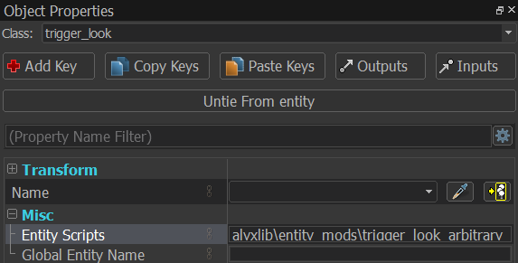
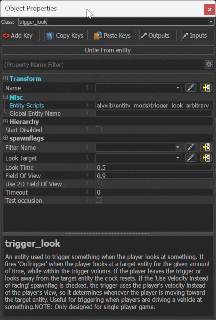

# Entity Mods

Entity mods are scripts which alter or extend the behavior of an existing entity class.

To activate an entity mod, add the entity mod script associated with the entity class to the entity's `Entity Scripts` property, with the format `alyxlib\entity_mods\[script name]`.

??? example
    

Entity mods often require custom property keys to be added to the entity. This can be done by clicking the "Add Key" button in the entity's properties window.

??? example
    

---

Make sure to read the specific entity mod's documentation for details on how to use it.