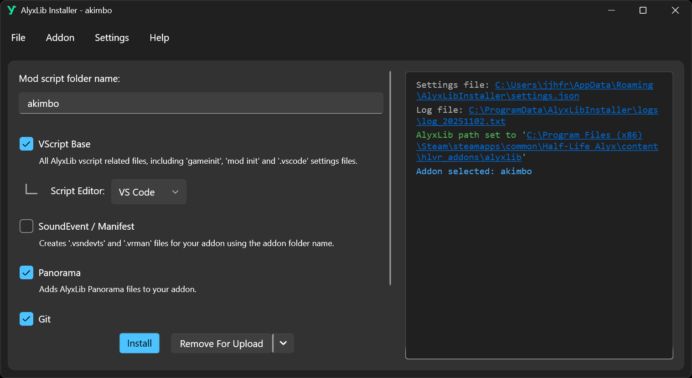
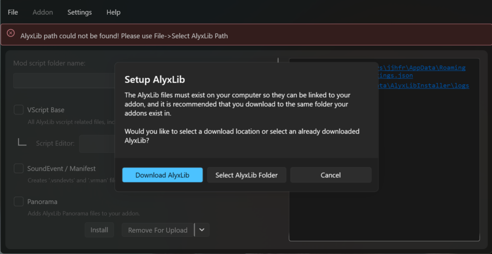
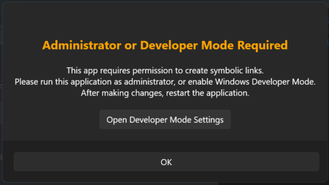
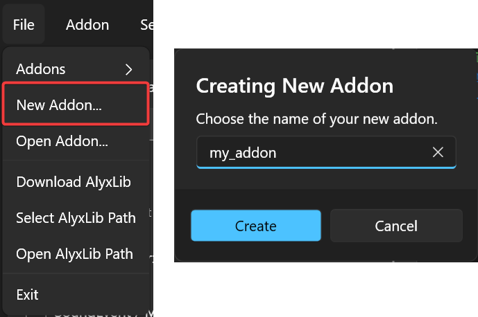
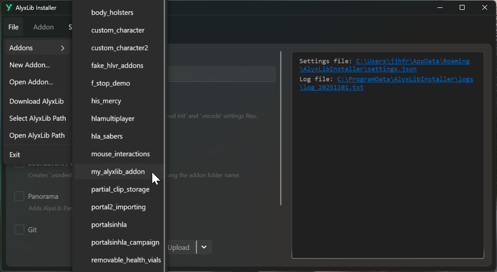
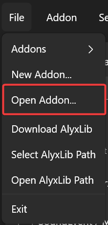
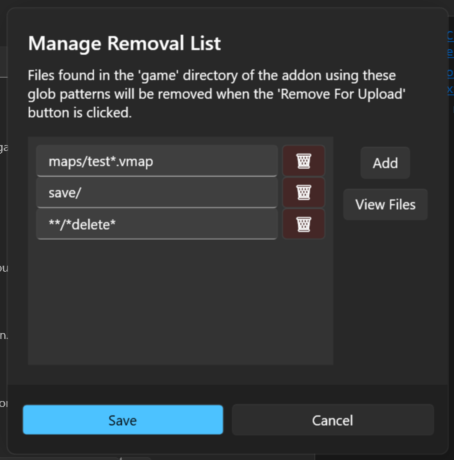
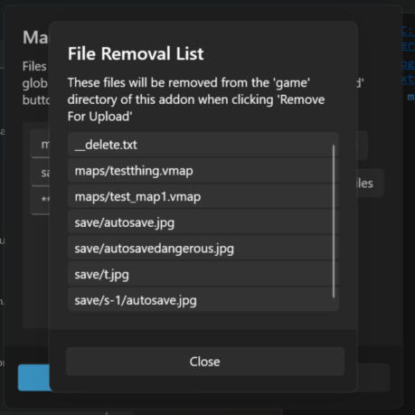
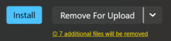

!!! info
    This guide will walk you through installing AlyxLib using the official [Installation Application](https://frostsource.github.io/AlyxLibInstaller/)

AlyxLib Installer is a user-friendly application that allows you to easily install and modify AlyxLib for addons.

[You can download the installer here](https://frostsource.github.io/AlyxLibInstaller/)

??? example "Preview"
    

## Choosing a version

AlyxLib Installer comes in two versions:

- **Self-Contained**

    Comes with the .NET 9 runtime needed to run the installer at the cost of a larger file size.

    *Recommended for most users*

- **Framework Dependent**

    Requires the [.NET 9 runtime](https://dotnet.microsoft.com/en-us/download/dotnet/9.0) to be installed on your computer.

    *Recommended for users that already work with C# or just want a small exe size*

## First time

When running for the first time you will be prompted to download or select AlyxLib.

- **Download AlyxLib**

    The latest version of AlyxLib will be downloaded to your computer at your desired location.

- **Select AlyxLib Folder**

    You will be prompted to select the folder that contains AlyxLib.

??? example "Image"
    

!!! note
    You will not be able to modify addons until a valid AlyxLib path has been set.

The installer needs permission to create symlinks, which requires either running the installer as administrator or turning on developer mode in Windows Settings.

??? example "Image"
    

!!! abstract ""
    If you do not want to use either of these methods you can install AlyxLib manually by following the instructions in the [Manual Installation](manual_installation.md) section.

## Using the installer

!!! note ""
    AlyxLib settings for your addon are saved to a hidden folder in your addon's `content` folder called `.alyxlib/config.json`.

### The console

The box on the right-hand side of the window contains the console output for the installer.

External links and file paths are automatically highlighted for you to click.

Text is colored based on the severity of the message:

- **White/Black**: Standard

- **Blue**: Important information

- **Green**: Success

- **Yellow**: Warning

- **Red**: Error

*Some text might use slightly different shades if you have [Verbose Logging](#settings) enabled.*

### Creating a new addon

To quickly create a new addon, use `File -> New Addon...` and choose a name for your new addon.

??? example "Image"
    
    

### Selecting an existing addon

If your addon exists in the `hlvr_addons` folder of your Half-Life Alyx installation, you can select it by opening the addons list in `File -> Addons`.

??? example "Image"
    

If your addon exists elsewhere, you can select it with `File -> Open Addon...`.

??? example "Image"
    

### Adding AlyxLib to your addon

AlyxLib has 6 configuration options:

1. **Mod script folder name**

    The name of the subfolder where scripts specific to your addon will be stored, e.g. `my_addon` will result in `scripts/vscripts/my_addon/`.

    You can change this name later but you must make sure the scripts in `mods/init` are updated to point to the new name.

2. **VScript Base**

    All AlyxLib vscript related files, including 'gameinit' and 'mod init' files.

3. **Script Editor**

    Adds default settings for the editor of your choice.

    !!! note ""
        Currently only Visual Studio Code is supported. See [Lua Language Server Addon Manager](https://luals.github.io/wiki/addons/#addon-manager) for how to install HLA-VScript extension.

4. **SoundEvent / Manifest**

    Creates or renames the default soundevent and manifest files to match your addon name.

5. **Panorama**

    Adds and compiles the AlyxLib panorama files for your addon. This is required if you want to add [Debug Menu](../components/debug_menu.md) content for your addon or use the menu in tools mode.

6. **Git**

    Initializes a Git repository in your addon folder. No initial commit is made. *[Git must be installed](https://git-scm.com/) on your computer and available in your PATH.*

After choosing your desired options, click `Install` and wait for the installer to finish. If you chose **Panorama** you might see a command prompt window open for a moment as the installer compiles the files.

### Preparing for upload

When you're ready to upload your addon to the Steam workshop, it's important that you click `Remove For Upload` to temporarily remove AlyxLib files that can cause conflicts.

After the installer has finished, you may upload your addon using the Half-Life Alyx tools.

After uploading, click `Install` again to restore the AlyxLib files in your addon.

### Removing AlyxLib from your addon

You can remove AlyxLib options from your addon by unticking the options you want to remove and then clicking the *down arrow* next to the `Remove For Upload` button, followed by `Remove Unticked Items`.

??? example "Image"
    

In the same menu you can also completely remove AlyxLib from your addon by clicking `Remove All AlyxLib Files`.

??? example "Image"
    

This will remove any AlyxLib related files that have not been modified in your addon. Any files that do not match the contents of a fresh install will not be deleted, including soundevent files and script files.

### Using file removal on upload

AlyxLib Installer comes with a feature for removing any files in your addon's `game` folder when you click `Remove For Upload`.

These files can be defined in `Addon -> Manage Removal List`.

File removal uses [glob patterns](https://www.malikbrowne.com/blog/a-beginners-guide-glob-patterns/) to match file paths.

To add a new pattern, click `Add`. You can then enter a glob pattern in the empty field.

To remove a pattern, click the button with the trashcan icon next to it.

??? example "Image"
    

At any point you can click `View Files` to see a list of all files in your addon's `game` folder that match the patterns in the removal list.

??? example "Image"
    

When you're ready, click `Save` to save the removal list to your addon profile, or `Cancel` to discard the changes.

If any files match the patterns in the removal list, the installer will remind you of this with a note of how many below the `Remove For Upload` button. This note can be clicked to see a list of the files that will be removed.

??? example "Image"
    

## Settings

You can configure installer settings in the `Settings` file menu.

- **Remember Last Addon**

    Remember the last addon you opened the next time you open the installer.

- **Verbose Logging**

    More detailed information is logged in the console for debugging and troubleshooting purposes.

- **Max Log Files**

    The maximum number of log files to keep. Old log files will be deleted when the maximum is reached.

- **Theme**

    Choose a theme for the installer.

- **Clear Console**

    Clears all text from the console. This does not delete any log files.

- **Add Explorer Context Menu**

    Adds a context menu item to the explorer right-click menu that allows you to open a selected folder in the installer.

    In Windows 11 you'll need to click `Show more options` after right clicking to show the context menu, or Shift + Right Click to open it directly.

    If you rename, move or delete the installer exe, you will need to re-add the context menu item using this menu item.

- **Remove Explorer Context Menu**

    Removes the context menu item from the explorer right-click menu.

## Troubleshooting

If you encounter any errors/exceptions, please send the relevant log file using one of the methods in [Help Section](../index.md#need-help)

You can find the log file by clicking the file link at the top of the console output, or by navigating to `C:\ProgramData\AlyxLibInstaller\logs\log_YYYYMMDD.txt` where `YYYYMMDD` is the current date.