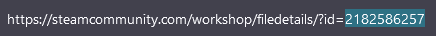
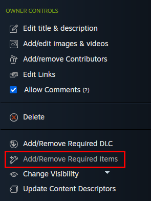

Before uploading your addon to the Steam workshop you **must** remove the following folders/files from your addon **game** directory:

* `scripts/vscripts/alyxlib`
* `scripts/vscripts/game/gameinit.lua`
* `panorama/layout/custom_game/alyxlib_debug_menu.vxml_c`
* `panorama/scripts/custom_game/alyxlib_debug_menu.vjs_c`
* `panorama/scripts/custom_game/panorama_lua.vjs_c`
* `panorama/styles/custom_game/alyxlib_debug_menu.vcss_c`

    Before uploading your addon to the Steam workshop you must run the file called `on_upload.bat` which was created in your addon root folder. This batch file was generated by AlyxLib to make removing symlinks easy so they are not uploaded to the workshop, which can cause conflicts. After running the script it will remove any AlyxLib files that shouldn't be uploaded and then it will pause while it waits for you to upload your addon to the workshop. Leave `on_upload.bat` running while you upload your addon like normal.

***

**If this your first time uploading the addon to the workshop** you will need to copy the workshop ID number which you can find at the end of the URL of your workshop item after uploading:

Locate and rename the zero-padded init script for your addon `scripts/vscripts/mods/init/0000000000.lua` to the ID of your workshop item, e.g. `scripts/vscripts/mods/init/2182586257.lua`. This is required for AlyxLib/Scalable Init Support to load your addon automatically. At this point you will need to **re-upload** your addon to the workshop with the newly named script file.

In the OWNER CONTROLS panel of your workshop page (must be logged in to view) select **Add/Remove Required Items** and choose the official AlyxLib workshop item as a requirement.

---

After completing your workshop upload, return to the running `on_upload.bat` file and follow the instructions to restore the AlyxLib files for local development. If you accidentally close `on_upload.bat` before it restores the files you can simply run it again all the way through, or in the worst-case scenario you can re-run the setup from `alyxlib.py`.

**It is important to follow this step every time you upload to the workshop! Your addon may not be functional for players if you upload with the AlyxLib symlinks still existing.**